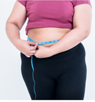

# Especificações do Projeto

Com base nos dados apresentados, catalogamos através de entrevistas pessoas que fazem uso da dieta Low Carb seja ela para prevenção, redução ou ferramenta de trabalho (nutricionistas, e personal trainer). Os detalhes levantados nesse processo foram consolidados na forma de personas e histórias de usuários.

## Personas

As personas levantadas durante o processo de entendimento do problema são apresentadas nas tabelas que se seguem.

<table border="1" width="70%">

<tr>
    <th rowspan="2"></th>
    <td colspan="2" align="right"><b>Marisa Camargo</b> </td>
</tr>
<tr>
    <td><b>Idade:</b>51    <b>Ocupação:</b> funcionária pública. Atua no Ministério Público do Estado de Minas Gerais (vara da criança e adolescente).
          
    </td> 
       <td><b>Aplicativos:</b> <ul><li>Instagram</li><li>Whatsapp</li><li>Twitter</li>
</ul>
           
    </td> 
     
    <td><b>Motivações: </b><ul><li>Trabalho</li><li>Família</li><li>Aplicação do Direito</li>
    </td>  
      
    <td><b>Frustações: </b><ul><li>Obesidade</li><li>Baixa remuneração</li><li>Falta de reconhecimento</li>
    </td>  
</ul>
           
    </td> 
     
    <td><b>Hobbies, História: </b><ul><li>Cinema</li><li>Shows</li><li>Teatros</li>
    </td>  
      
</tr>
</table>

<table border="1" width="70%">
<tr>
    <th></th>
    <td></td>
</tr>
<tr>
    <th rowspan="2"></th> 
    <td colspan="2" align="right"><b>Valéria Prado</b></td>
</tr>
<tr>
    <td><b>Idade:</b>33   <b>Ocupação:</b> nutricionista. Atua em uma academia. Possui um consultório para atendimento direcionado.
        
    </td> 
    <td> <b>Aplicativos:</b> <ul><li>Instagram<ul><li>WhatsApp<ul><li>Facebook</li>
    </ul>
           
    </td> 
     
    <td><b>Motivações: </b><ul><li>Trabalho</li><li>Forma física</li><li>Saúde Preventiva</li>
    </td>  
      
    <td><b>Frustações: </b><ul><li>Mercado Competitivo</li>
    </td>  
</ul>
           
    </td> 
     
    <td><b>Hobbies, História: </b><ul><li>Praticar Esportes</li><li>Cinemas</li><li>Shows</li>
    </td>  
      
</tr>
<table border="1" width="70%">
<tr>
    <th></th>
    <td></td>
</tr>
<tr>
    <th rowspan="2"></th> 
    <td colspan="2" align="right"><b>Carlos Eduardo</b></td>
</tr>
<tr>
    <td><b>Idade:</b>28   <b>Ocupação:</b> advogado, atua em ações do Direito de família.
        
    </td> 
    <td> <b>Aplicativos:</b> <ul><li>Instagram<ul><li>WhatsApp<ul><li>Teams</li>
    </ul>
           
    </td> 
     
    <td><b>Motivações: </b><ul><li>Trabalho</li><li>Família</li>
    </td>  
      
    <td><b>Frustações: </b><ul><li>Saúde Física</li>
    </td>  
</ul>
           
    </td> 
     
    <td><b>Hobbies, História: </b><ul><li>Cinemas</li><li>Shows</li>
    </td>  
      
</tr>
<table border="1" width="70%">
<tr>
    <th></th>
    <td></td>
</tr>
<tr>
    <th rowspan="2"></th> 
    <td colspan="2" align="right"><b>Wesley Souza</b></td>
</tr>
<tr>
    <td><b>Idade:</b>29   <b>Ocupação:</b>Programador. Atua em multinacional como iOS Software Engineer.
        
    </td> 
    <td> <b>Aplicativos:</b> <ul><li>Instagram<ul><li>WhatsApp<ul><li>Teams</li><li>Linkedin</li><li>Youtube</li>
    </ul>
           
    </td> 
     
    <td><b>Motivações: </b><ul><li>Estilo de trabalho (home office)</li><li>Saúde preventiva</li><li>Forma Física</li>
    </td>  
      
    <td><b>Frustações: </b><ul><li>Obesidade</li><li>Sedentarismo</li><li>Saúde Mental e Física</li><li>Baixa autoestima</li>
    </td>  
</ul>
           
    </td> 
     
    <td><b>Hobbies, História: </b><ul><li>Jogos Virtuais</li><li>Eventos de carros antigos</li>
    </td>  
      
</tr>
<table border="1" width="70%">
<tr>
    <th></th>
    <td></td>
</tr>
<tr>
    <th rowspan="2"></th> 
    <td colspan="2" align="right"><b>Suelen Cristina</b></td>
</tr>
<tr>
    <td><b>Idade:</b>49   <b>Ocupação:</b> Empresária. Atua no comércio de roupas fitness. 
        
    </td> 
    <td> <b>Aplicativos:</b> <ul><li>Instagram<ul><li>WhatsApp<ul><li>Facebook</li>
    </ul>
           
    </td> 
     
    <td><b>Motivações: </b><ul><li>Saúde Preventiva</li><li>Forma física</li>
    </td>  
      
    <td><b>Frustações: </b><ul><li>Sedentarismo</li><li>Saúde Mental</li>
    </td>  
</ul>
           
    </td> 
     
    <td><b>Hobbies, História: </b><ul><li>Assistir Seriados</li><li>Cozinhar</li><li>Viajar</li>
    </td>  
      
</tr>
<table border="1" width="70%">
<tr>
    <th></th>
    <td></td>
</tr>
<tr>
    <th rowspan="2"></th> 
    <td colspan="2" align="right"><b>Daniela Queiroz</b></td>
</tr>
<tr>
    <td><b>Idade:</b>25   <b>Ocupação:</b>Educadora física. Atua como personal trainer em academias. 
        
    </td> 
    <td> <b>Aplicativos:</b> <ul><li>Instagram<ul><li>WhatsApp<ul><li>Youtube</li>
    </ul>
           
    </td> 
     
    <td><b>Motivações: </b><ul><li>Saúde Preventiva</li><li>Forma física</li><li>Conhecimento</li>
    </td>  
      
    <td><b>Frustações:</b><ul><li>Falta de Tempo</li><li>Baixa Remuneração</li>
    </td>  
</ul>
    
    </td> 
     
    <td><b>Hobbies, História: </b><ul><li>Praticar Esportes</li><li>Cozinhar</li><li>Viajar</li><li>Dançar</li>
    </td>  
      
</tr>
<table border="1" width="70%">
<tr>
    <th></th>
    <td></td>
</tr>
<tr>
    <th rowspan="2"></th> 
    <td colspan="2" align="right"><b>Davi Rocha</b></td>
</tr>
<tr>
    <td><b>Idade:</b>32   <b>Ocupação:</b>Jornalista. Atua redator de conteúdo em site de famosos. 
        
    </td> 
    <td> <b>Aplicativos:</b> <ul><li>Instagram<ul><li>WhatsApp<ul><li>Youtuber</li><li>Twitter</li>
    </ul>
           
    </td> 
     
    <td><b>Motivações: </b><ul><li>Saúde</li><li>Forma física</li><li>Connhecimento</li>
    </td>  
      
    <td><b>Frustações: </b><ul><li>Portador de diabetes tipo 2</li>
    </td>  
</ul>
           
    </td> 
     
    <td><b>Hobbies, História: </b><ul><li>Filmes</li><li>Leituras</li><li>Viajar</li>
    </td>  
</ul>
      
</tr>

  
    
## Histórias de Usuários

Com base na análise das personas forma identificadas as seguintes histórias de usuários:

|EU COMO... `PERSONA`| QUERO/PRECISO ... `FUNCIONALIDADE` |PARA ... `MOTIVO/VALOR`                 |
|Marisa Camargo
    

Apresente aqui as histórias de usuário que são relevantes para o projeto de sua solução. As Histórias de Usuário consistem em uma ferramenta poderosa para a compreensão e elicitação dos requisitos funcionais e não funcionais da sua aplicação. Se possível, agrupe as histórias de usuário por contexto, para facilitar consultas recorrentes à essa parte do documento.

> **Links Úteis**:
> - [Histórias de usuários com exemplos e template](https://www.atlassian.com/br/agile/project-management/user-stories)
> - [Como escrever boas histórias de usuário (User Stories)](https://medium.com/vertice/como-escrever-boas-users-stories-hist%C3%B3rias-de-usu%C3%A1rios-b29c75043fac)
> - [User Stories: requisitos que humanos entendem](https://www.luiztools.com.br/post/user-stories-descricao-de-requisitos-que-humanos-entendem/)
> - [Histórias de Usuários: mais exemplos](https://www.reqview.com/doc/user-stories-example.html)
> - [9 Common User Story Mistakes](https://airfocus.com/blog/user-story-mistakes/)

## Requisitos

As tabelas que se seguem apresentam os requisitos funcionais e não funcionais que detalham o escopo do projeto.

### Requisitos Funcionais

|ID    | Descrição do Requisito  | Prioridade |
|------|-----------------------------------------|----|
|RF-001| Permitir que o usuário cadastre tarefas | ALTA | 
|RF-002| Emitir um relatório de tarefas no mês   | MÉDIA |

### Requisitos não Funcionais

|ID     | Descrição do Requisito  |Prioridade |
|-------|-------------------------|----|
|RNF-001| O sistema deve ser responsivo para rodar em um dispositivos móvel | MÉDIA | 
|RNF-002| Deve processar requisições do usuário em no máximo 3s |  BAIXA | 

Com base nas Histórias de Usuário, enumere os requisitos da sua solução. Classifique esses requisitos em dois grupos:

- [Requisitos Funcionais
 (RF)](https://pt.wikipedia.org/wiki/Requisito_funcional):
 correspondem a uma funcionalidade que deve estar presente na
  plataforma (ex: cadastro de usuário).
- [Requisitos Não Funcionais
  (RNF)](https://pt.wikipedia.org/wiki/Requisito_n%C3%A3o_funcional):
  correspondem a uma característica técnica, seja de usabilidade,
  desempenho, confiabilidade, segurança ou outro (ex: suporte a
  dispositivos iOS e Android).
Lembre-se que cada requisito deve corresponder à uma e somente uma
característica alvo da sua solução. Além disso, certifique-se de que
todos os aspectos capturados nas Histórias de Usuário foram cobertos.

## Restrições

O projeto está restrito pelos itens apresentados na tabela a seguir.

|ID| Restrição                                             |
|--|-------------------------------------------------------|
|01| O projeto deverá ser entregue até o final do semestre |
|02| Não pode ser desenvolvido um módulo de backend        |

Enumere as restrições à sua solução. Lembre-se de que as restrições geralmente limitam a solução candidata.

> **Links Úteis**:
> - [O que são Requisitos Funcionais e Requisitos Não Funcionais?](https://codificar.com.br/requisitos-funcionais-nao-funcionais/)
> - [O que são requisitos funcionais e requisitos não funcionais?](https://analisederequisitos.com.br/requisitos-funcionais-e-requisitos-nao-funcionais-o-que-sao/)
