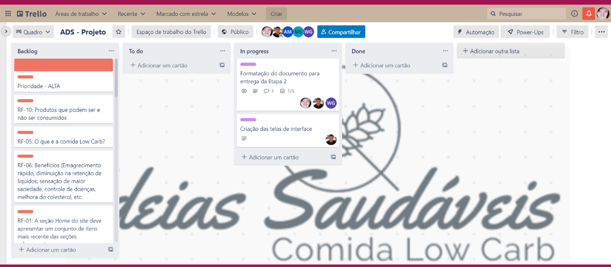

# Metodologia

A metodologia contempla as definições de ferramental utilizado pela equipe tanto para a manutenção dos códigos e demais artefatos quanto para a organização do time na execução das tarefas do projeto.

## Controle de Versão

A ferramenta de controle de versão adotada no projeto foi o
[Git](https://git-scm.com/), sendo que o [Github](https://github.com)
foi utilizado para hospedagem do repositório.

## Gerenciamento de Projeto

### Divisão de Papéis

A equipe utiliza metodologias ágeis, tendo escolhido o Scrum como base para definição do processo de desenvolvimento.

A equipe está organizada da seguinte maneira:

 - Scrum Master: Alessandra Thevenard;
 - Product Owner: Sanderlei Cabral;
 - Equipe de Desenvolvimento:
 > - Alessandra Thevenard;
 > - Sanderlei Cabral;
 - Equipe de Design;
 > - Alessandra Thevenard;
 > - Sanderlei Cabral;

### Processo

Para organização e distribuição das tarefas do projeto, a equipe está utilizando o Trello, estruturado com as seguintes listas: 

-	Backlog: recebe as tarefas a serem trabalhadas e representa o Product Backlog. Todas as atividades identificadas no decorrer do projeto também devem ser incorporadas a esta lista.
-	To Do: Esta lista representa o Sprint Backlog. Este é o Sprint atual que estamos trabalhando.
-	In progress: Quando uma tarefa tiver sido iniciada, ela é movida para cá.
-	Done: nesta lista são colocadas as tarefas que passaram pelos testes e controle de qualidade e estão prontos para ser entregues ao usuário. Não há mais edições ou revisões necessárias, ele está agendado e pronto para a ação.

O quadro kanban do grupo desenvolvido na ferramenta de gerenciamento de projetos está disponível através da URL https://trello.com/b/b9GwJP3W/ads-projeto e é apresentado, no estado atual, na Figura 1. 

 
 Figura 1

### Ferramentas

Os artefatos do projeto são desenvolvidos a partir de diversas plataformas e a relação dos ambientes com seu respectivo propósito é apresentada na tabela que se segue. 

|AMBIENTE   | PLATAFORMA  | LINK DE ACESSO |
|------|-----------------------------------------|----|
|Repositório de código fonte| GitHub | https://github.com/ICEI-PUC-Minas-PMV-ADS/pmv-ads-2022-2-e1-proj-web-t8-ideias-saudaveis-comida-low-carb | 
|Projeto de Interface e  Wireframes| Figma | https://www.figma.com/file/BCk5veOo715a6HCdXGGWsZ/wireframe---ideais-saud%C3%A1veis?node-id=0%3A1 |
|Gerenciamento do Projeto| Trello | https://trello.com/b/b9GwJP3W/ads-projeto |

