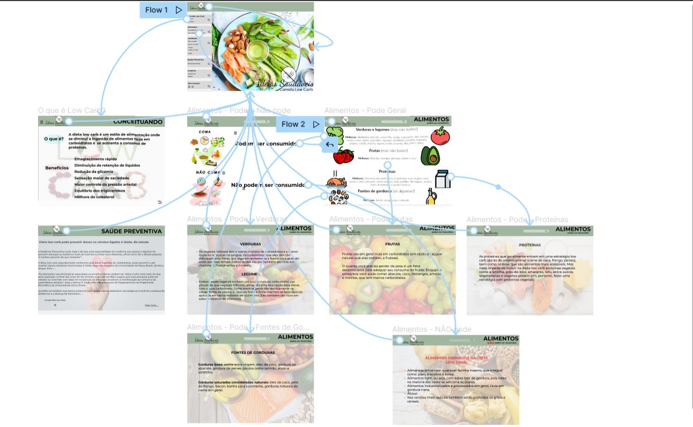

# Projeto de Interface

Dentre as preocupações para a montagem da interface do sistema, estamos estabelecendo foco em questões como agilidade, acessibilidade e usabilidade. Desta forma, o projeto tem uma identidade visual padronizada em todas as telas que são projetadas para funcionamento em desktops e dispositivos móveis.

Pré-requisitos: <a href="2-Especificação do Projeto.md"> Documentação de Especificação</a>

Visão geral da interação do usuário pelas telas do sistema e protótipo interativo das telas com as funcionalidades que fazem parte do sistema (wireframes).

 Apresente as principais interfaces da plataforma. Discuta como ela foi elaborada de forma a atender os requisitos funcionais, não funcionais e histórias de usuário abordados nas <a href="2-Especificação do Projeto.md"> Documentação de Especificação</a>.

## Fluxo do Usuário

O diagrama apresentado na Figura 2 mostra o fluxo de interação do usuário pelas telas do sistema. Cada uma das telas deste fluxo é detalhada na seção de Wireframes que se segue. Para visualizar o wireframe interativo, acesse o *ambiente figma do projeto.

 
 
 Figura 2 - Fluxo de telas do usuário

## Wireframes

Conforme fluxo de telas do projeto, apresentado no item anterior, as telas do sistema são apresentadas em detalhes nos itens que se seguem. As telas do sistema apresentam 3 estruturas básicas relacionadas à sua hierarquia, conforme descrito abaixo:
● Home - apresenta todas as telas e é o local onde são dispostos elementos fixos de identidade (logo) e navegação principal do site (menu da aplicação).
● Conteúdo de destaque - todas as telas possuem um conteúdo de destaque, identificado por uma imagem e título do conteúdo. Destaca-se pela maior área de ocupação na tela, de aproximadamente 2/3 do seu espaço útil.
● Conteúdo secundário - apresenta os elementos de navegação secundária ocupam o espaço lateral restante do grid de ocupação da tela.  

## Tela - Home Page

A Homepage funciona como portal de entrada para as informações do site, contendo a apresentação da logo e um menu fixo de navegação que leva às seções de conteúdo do site, sendo elas: Comida low carb: o que é e benefícios; Alimentos e Saúde preventiva.

 

Figura 3 - Tela Home-Page 