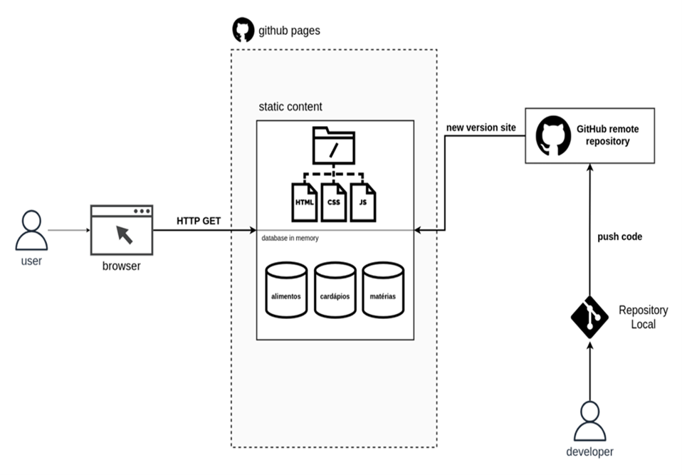

# Arquitetura da Solução

Nesta seção são apresentados os detalhes técnicos da solução criada pela equipe, tratando dos componentes que fazem parte da solução e do ambiente de hospedagem da solução. 

## Diagrama de componentes

Os componentes que fazem parte da solução são apresentados na Figura que se segue.

Figura 7 - Arquitetura da Solução  

 

## Tecnologias Utilizadas

As tecnologias utilizadas foram: CSS, HTML, JavaScript, Visual Studio Code, GitHub Pages.

A solução implementada conta com os seguintes módulos:

●	Módulo da aplicação:  
○	Páginas Web - Conjunto de arquivos HTML, CSS, JavaScript e imagens que compõem a aplicação.  
○	Data Base - Os bancos e dados serão mantidos de maneira estática dentro da camada de dados da aplicação. Os dados serão armazenados em formato de JSON. 

## Hospedagem
Infraestrutura e operação Será utilizado a plataforma GitHub Pages como ambiente de hospedagem. 

O site é mantido no ambiente da URL: 

https://github.com/ICEI-PUC-Minas-PMV-ADS/pmv-ads-2022-2-e1-proj-web-t8-ideias-saudaveis-comida-low-carb

O fluxo de entrega da evolução da aplicação será feito por meio da submissão requisições de modificações do código fonte direcionada via push para repositório remoto da aplicação no GitHub. Dada a aceitação da modificação, o Github gerar uma nova versão e enviara para instancia da aplicação no GitHub Pages. 