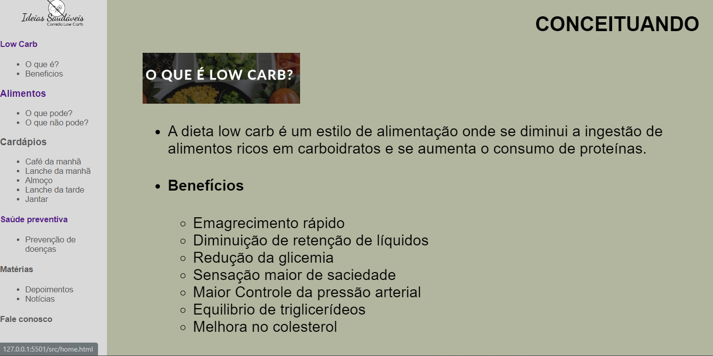
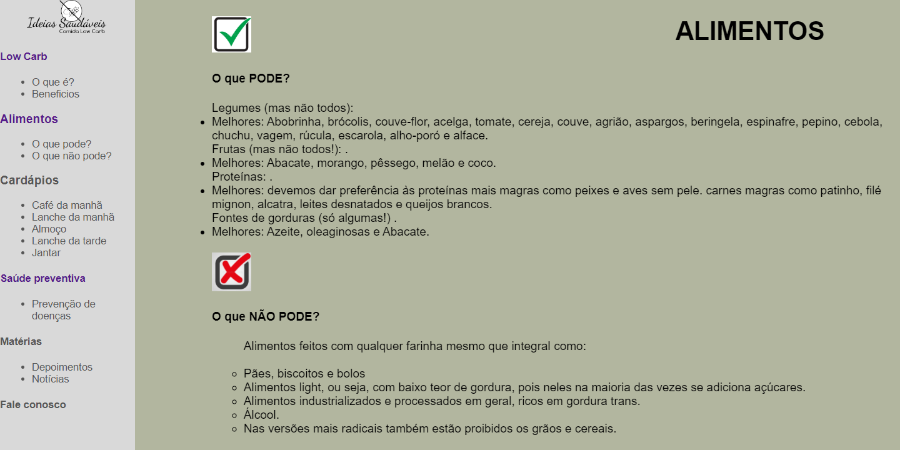
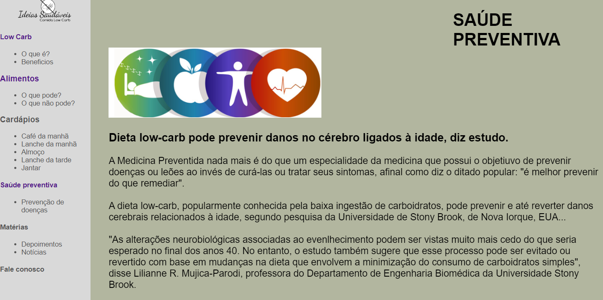

# Template padrão do site

O padrão de layout utlizado seguiu os aspectos determinados pelo protótipo elaborado.

O template criado contém os seguintes layouts:

<ul>
<li>Tela Principal - Home</li>
<li>Tela Conceituando</li>
<li>Tela Alimentos</li>
<li>Tela Saúde Preventiva</li>                                       
</ul>

<h1> Home </h1> 

 A tela principal contempla acesso aos demais ambientes do site através de um link. O usuário pré-visualiza as informações através da barra e com um clic acessa as informações. 

<h1> Low Carb </h1> 

 A tela Conceituando, fornece informações introdutórias, conceituando o termo Low Carb, bem como elencando os principais benefícios de uma alimentação voltada para esse segmento. 

<h1> Alimentos </h1> 

 A tela Alimentos, informa de modo categórico os alimemntos que podem e não podem fazer parte de uam dieta Low Carb.

<h1> Saúde Preventiva </h1> 

 A tela Saúde Preventiva, traz conhecimento sobre a importância da Medicina Preventiva, sua contribuição na prevenção de doenças. Atrelada a esse pensamento, surge um segmento nutricional, capaz de obter resultados preventivos contra as mais diversas doenças.

