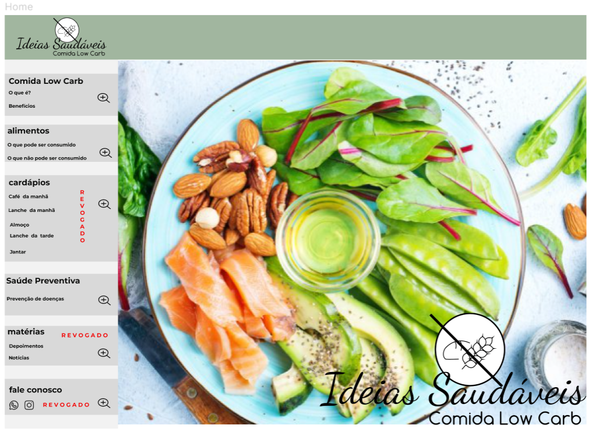
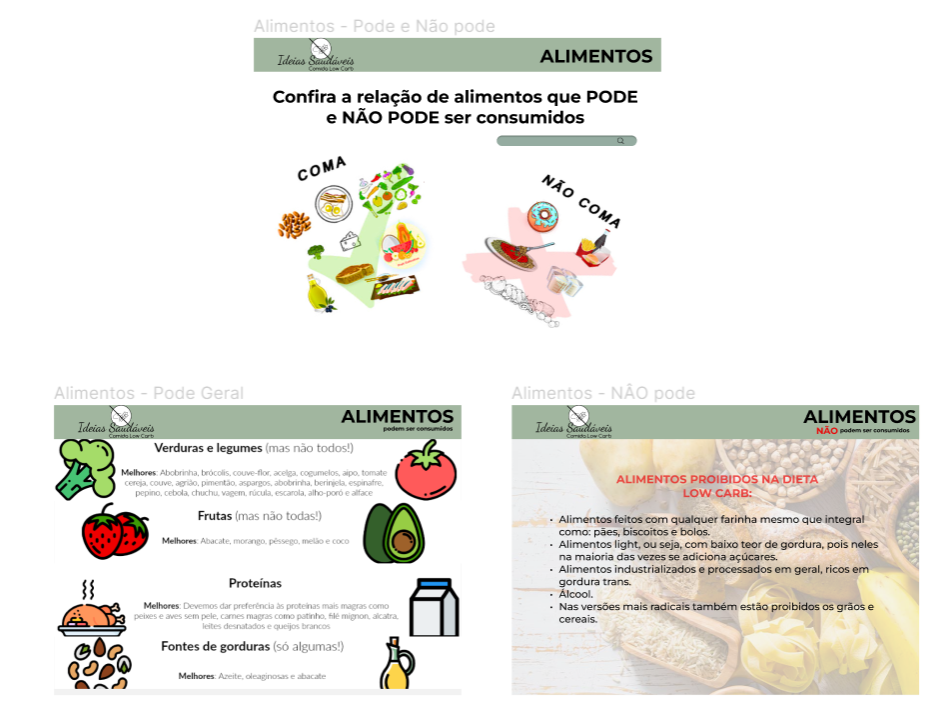
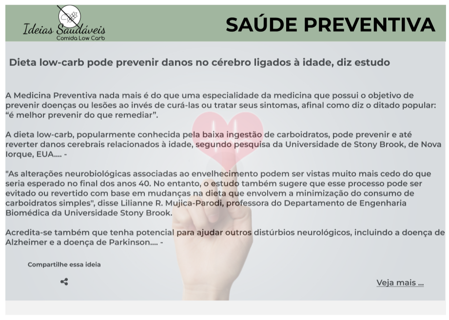

# Programação de Funcionalidades

Nesta seção, será apresentada as telas desenvolvidas de acordo com a especificação de cada Requisito Funcional:

 <strong>Tela - Home Page</strong>

A tela principal apresenta de modo geral as espefificações do consumo da Comida Low Carb, seus benefícios, indicação de alimentos e como uma dieta preventiva pode acarretar inúmeros benefífios à saúde.  

 
Figura 1 - Tela Home-Page  

 

<strong> Requisitos atendidos:</strong>

RF-01: A seção Home é o portal de entrada, contendo um menu fixo para suas 3 seções, sendo elas: Low Carb – o que é e benefícios, Alimentos e Saúde preventiva.

<strong>Artefatos da funcionalidade</strong>
 
<ul>
<li>index.html</li> 
<li>Modelologo.png </li> 
<li>style.css</li> 

<strong>Estrutura de Dados</strong>
 
<!DOCTYPE html>
<html lang="pt-br">
<head>
    <meta charset="UTF-8">
    <meta http-equiv="X-UA-Compatible" content="IE=edge">
    <link rel="stylesheet" href="../src/css/home.css">
    <title>Ideias Saudáveis - Comida Low Carb</title>
</head>
<body>

    

        
    

    

            

            <h3> <a href="conceituando.html">Low Carb</a></h3>
            <h4> O que é</h4>
            <h4> Beneficios</h4>
            

    

    

            

                <h3> <a href="alimentos.html">Alimentos</a></h3>
            <h4> O que pode ser consumido</h4>
            <h4> O que não pode ser consumido</h4>
            

    

    

            

            <h3> Cardápios</h3>
            <h4> Café da manhã</h4>
            <h4> Lanche da manhã</h4>
            <h4> Almoço</h4>
            <h4> Lanche da tarde</h4>
            <h4> Jantar</h4>
            

    

    

            

            <h3> Saúde preventiva</h3>
            <h4> Prevenção de doenças</h4>
            

    

    

            

            <h3> Matérias</h3>
            <h4> Depoimentos</h4>
            <h4> Notícias</h4>
            

    

    

            

            <h3> Fale conosco</h4>
                <h4> substituir por icones</h4>
            

    

    
    

                        
    
   
      
    
</body>
</html>

<strong>Instruções de acesso</strong> 

1º. Abra um navegador de Internet e informe a seguinte URL: http://127.0.0.1:5501/src/home.html 
2º. A tela home é a primeira funcionalidade exibida pelo aplicativo.

<strong>Tela - Comida Low Carb</strong>

A tela conceitua o que seria uma alimentação baseada na dieta Low Carb, assim como descreve alguns benefícios advindos dessa prática.  

 
Figura 2 - Tela Conceituando  

 

<strong> Requisitos atendidos:</strong>

RF-02: O que é comida Low Carb? Quais os Benefícios?

<strong>Artefatos da funcionalidade</strong>
 
<ul>
<li>index.html</li> 
<li>Modelologo.png </li> 
<li>style.css</li> 

<strong>Estrutura de Dados</strong>
 

<!DOCTYPE html>
<html lang="pt-br">
<head>
    <meta charset="UTF-8">
    <meta http-equiv="X-UA-Compatible" content="IE=edge">
    <link rel="stylesheet" href="../src/css/conteudo.css">
    <title>Conceituando</title>

    

        
    

    

        
            <h1> CONCEITUANDO</h1>
        
    

</head>

<body>

    

        
            
 EM CONSTRUÇÃO 

        
    

</body>

</html>

<strong>Tela - Alimentos</strong>

A tela descreve alguns alimentos essenciais para uma dieta Low carb, bem como aqueles que NÃO podem compor o quadro de alimentos aptos para ingestão. 

 
Figura 3 - Tela Alimentos  

 

<strong> Requisitos atendidos:</strong>

RF-03: A seção Alimentos deve conter uma funcionalidade de filtro/pesquisa para
permitir ao usuário localizar um alimento por nome.

<strong>Artefatos da funcionalidade</strong>
 
<ul>
<li>index.html</li> 
<li>Modelologo.png </li> 
<li>style.css</li> 

<strong>Estrutura de Dados</strong>
 

<!DOCTYPE html>
<html lang="pt-br">
<head>
    <meta charset="UTF-8">
    <meta http-equiv="X-UA-Compatible" content="IE=edge">
    <link rel="stylesheet" href="../src/css/conteudo.css">
    <title>alimentos</title>

    

        
    

    

        
            <h1>ALIMENTOS</h1>
    
    

</head>

<body>

    

        
            
 EM CONSTRUÇÃO 

       
    

</body>

</html>

<strong>Tela - Saúde Preventiva</strong>

A tela descreve a contribuição da Medicina Preventiva no combate à doenças ligadas ao consumo de alimentos nada saudáveis.

 
Figura 4 - Tela Saúde Preventiva  

 

<strong> Requisitos atendidos:</strong>

RF-04: Saúde Preventiva – benefícios diários e prevenção de doenças - portal deve apresentar uma seção destinada à prevenção de doenças devido ao consumo de alimentos saudáveis.

<strong>Artefatos da funcionalidade</strong>
 
<ul>
<li>index.html</li> 
<li>Modelologo.png </li> 
<li>style.css</li> 

<strong>Estrutura de Dados</strong>
 

<!DOCTYPE html>
<html lang="pt-br">
<head>
    <meta charset="UTF-8">
    <meta http-equiv="X-UA-Compatible" content="IE=edge">
    <link rel="stylesheet" href="../src/css/conteudo.css">
    <title>Saúde preventiva</title>

    

        
    

    

        
            <h1>SAÚDE PREVENTIVA</h1>
        
    

</head>

<body>

    

    
            
 EM CONSTRUÇÃO 

    

</body>

</html>