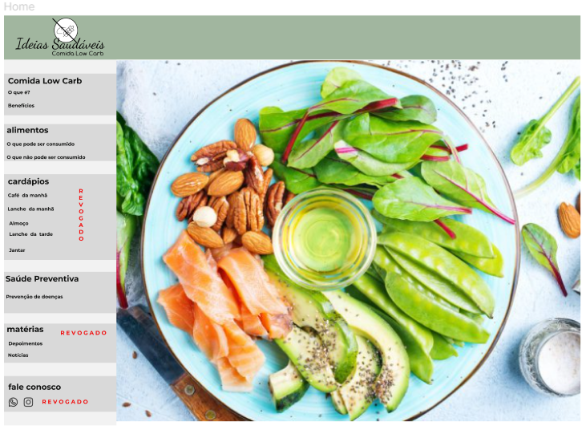
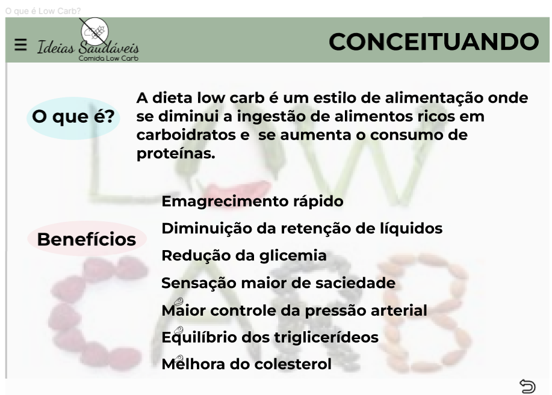
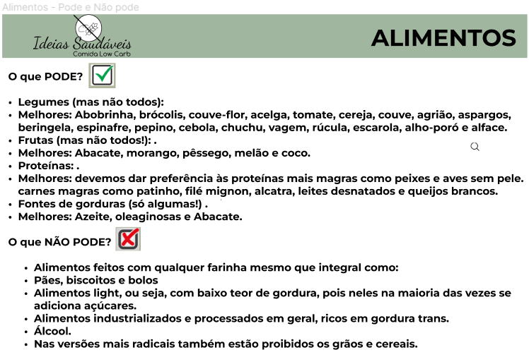
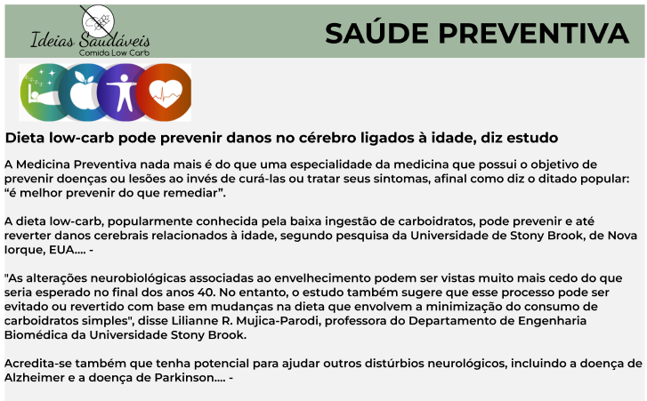

# Programação de Funcionalidades

Nesta seção, será apresentada as telas desenvolvidas de acordo com a especificação de cada Requisito Funcional:

 <strong>Tela - Home Page</strong>

A tela principal apresenta de modo geral as espefificações do consumo da Comida Low Carb, seus benefícios, indicação de alimentos e como uma dieta preventiva pode acarretar inúmeros benefífios à saúde.  

 
Figura 1 - Tela Home-Page  

 

<strong> Requisitos atendidos:</strong>

RF-01: A seção Home é o portal de entrada, contendo um menu fixo para suas 3 seções, sendo elas: Low Carb – o que é e benefícios, Alimentos e Saúde preventiva.

<strong>Artefatos da funcionalidade</strong>
 
<ul>
<li>index.html</li> 
<li>Modelologo.png </li> 
<li>style.css</li> 

<strong>Estrutura de Dados - HTML</strong>
 
<!DOCTYPE html>
<html lang="pt-br">
<head>
    <meta charset="UTF-8">
    <meta http-equiv="X-UA-Compatible" content="IE=edge">
    <link rel="stylesheet" href="../src/css/home.css">
    <link rel="stylesheet" href="css/shared.css">
        <title>Ideias Saudáveis - Comida Low Carb</title>
</head>
<body>
    

        

            
                  
            
            <h4> <a href="conceituando.html">Low Carb</a></h4>
            <ol class="lista-sidemenu">
                <li>O que é?</li>
                <li>Beneficios</li>
            </ol>

            <h3> <a href="alimentos.html">Alimentos</a></h3>
            <ol class="lista-sidemenu">
                <li>O que pode?</li>
                <li>O que não pode?</li>
            </ol>

            <h3> Cardápios</h3>
            <ol class="lista-sidemenu">
                <li>Café da manhã</li>
                <li>Lanche da manhã</li>
                <li>Almoço</li>
                <li>Lanche da tarde</li>
                <li>Jantar</li>
            </ol>

            <h4> <a href="saudeprev.html">Saúde Preventiva</a></h4>
            <ol class="lista-sidemenu">
                <li> Prevenção de doenças</li>
            </ol>

            <h4> Matérias</h4>
            <ol class="lista-sidemenu">
                <li>Depoimentos</li>
                <li>Notícias</li>
            </ol>

            <h4> Fale conosco</h4>
                
        

    

    
    

<strong>Estrutura de Dados - CSS</strong>

#col{
    display: inline;
    width: 85%;
    height: 100vh;
    float: right;
    background-image: 
    url("/src/imagem/imagem01.png");
    background-size: 100%;
    background-repeat: no-repeat;
}

</body>
</html>  

<strong>Instruções de acesso</strong> 

1º. Abra um navegador de Internet e informe a seguinte URL: http://127.0.0.1:5501/src/home.html 
2º. A tela home é a primeira funcionalidade exibida pelo aplicativo.

<strong>Tela - Comida Low Carb</strong>

A tela conceitua o que seria uma alimentação baseada na dieta Low Carb, assim como descreve alguns benefícios advindos dessa prática.  

  
Figura 2 - Tela Conceituando  

 

<strong> Requisitos atendidos:</strong>

RF-02: O que é comida Low Carb? Quais os Benefícios?

<strong>Artefatos da funcionalidade</strong>
 
<ul>
<li>index.html</li> 
<li>Modelologo.png </li> 
<li>style.css</li> 

<strong>Estrutura de Dados - HTML</strong>
 

<!DOCTYPE html>
<html lang="pt-br">
<head>
    <meta charset="UTF-8">
    <meta http-equiv="X-UA-Compatible" content="IE=edge">
    <link rel="stylesheet" href="css/shared.css">
    <link rel="stylesheet" href="../src/css/conceituando.css">
    <title>Conceituando</title>
    <a href="home.html">Home</a>
</head>

<body>
    

        

            

            <h4> <a href="conceituando.html">Low Carb</a></h4>
            <ol class="lista-sidemenu">
                <li>O que é?</li>
                <li>Beneficios</li>
            </ol>

            <h3> <a href="alimentos.html">Alimentos</a></h3>
            <ol class="lista-sidemenu">
                <li>O que pode?</li>
                <li>O que não pode?</li>
            </ol>

            <h3> Cardápios</h3>
            <ol class="lista-sidemenu">
                <li>Café da manhã</li>
                <li>Lanche da manhã</li>
                <li>Almoço</li>
                <li>Lanche da tarde</li>
                <li>Jantar</li>
            </ol>

            <h4> <a href="saudeprev.html">Saúde preventiva</a></h4>
            <ol class="lista-sidemenu">
                <li> Prevenção de doenças</li>
            </ol>

            <h4> Matérias</h4>
            <ol class="lista-sidemenu">
                <li>Depoimentos</li>
                <li>Notícias</li>
            </ol>

            <h4> Fale conosco</h4>
                
        

    

    

        <h1 class="titulo">CONCEITUANDO</h1>
        

        
            <ul>
                <li>
                    
    
A dieta low carb é um estilo de alimentação onde se diminui a ingestão de alimentos ricos em carboidratos e se aumenta o consumo de proteínas.

                </li>
                <li>
                    <h4>Benefícios</h4>
                    <ul>
                        <li>Emagrecimento rápido</li>
                        <li>Diminuição de retenção de líquidos</li>
                        <li>Redução da glicemia</li>
                        <li>Sensação maior de saciedade</li>
                        <li>Maior Controle da pressão arterial</li>
                        <li>Equilibrio de triglicerídeos</li>
                        <li>Melhora no colesterol</li>

                    </ul>
                </li>
            </ul>
        

    

<strong>Estrutura de Dados - CSS</strong>

#descricao{
    display: inline;
    width: fit-content;
    float:left;
    position: fixed;
    left: 20%;
    top: 15%;
   
    font-family: Helvetica;
    font-size: 24px;
}

</body>

</html>

<strong>Tela - Alimentos</strong>

A tela descreve alguns alimentos essenciais para uma dieta Low carb, bem como aqueles que NÃO podem compor o quadro de alimentos aptos para ingestão. 

  
Figura 3 - Tela Alimentos  

 

<strong> Requisitos atendidos:</strong>

RF-03: A seção Alimentos deve conter um ambiente focado no consumo de alimentos. Dentre esses o que podem fazer parte de uma dieta Low Carb, bem como aqueles que são de consumo proibido.

<strong>Artefatos da funcionalidade</strong>
 
<ul>
<li>index.html</li> 
<li>Modelologo.png </li> 
<li>style.css</li> 

<strong>Estrutura de Dados - HTML</strong>
 

<!DOCTYPE html>
<html lang="pt-br">
<head>
    <meta charset="UTF-8">
    <meta http-equiv="X-UA-Compatible" content="IE=edge">
    <link rel="stylesheet" href="../src/css/alimentos.css">
    <link rel="stylesheet" href="css/shared.css">
    
    <title>Alimentos</title>
    
    <a href="home.html">Home</a>
</head>

<body>
    

        

            
            <h4> <a href="conceituando.html">Low Carb</a></h4>
            <ol class="lista-sidemenu">
                
                <li>O que é?</li>
                <li>Beneficios</li>
            </ol>
            <h3> <a href="alimentos.html">Alimentos</a></h3>
            <ol class="lista-sidemenu">
                <li>O que pode?</li>
                <li>O que não pode?</li>
            </ol>
            <h3> Cardápios</h3>
            <ol class="lista-sidemenu">
                <li>Café da manhã</li>
                <li>Lanche da manhã</li>
                <li>Almoço</li>
                <li>Lanche da tarde</li>
                <li>Jantar</li>
            </ol>
            <h4> <a href="saudeprev.html">Saúde preventiva</a></h4>
            <ol class="lista-sidemenu">
                <li> Prevenção de doenças</li>
            </ol>
            <h4> Matérias</h4>
            <ol class="lista-sidemenu">
                <li>Depoimentos</li>
                <li>Notícias</li>
            </ol>
            <h4> Fale conosco</h4>
    

    

    

        <h1 class="titulo">ALIMENTOS</h1>
        

        <ul>
           
    <h4>O que PODE?</h4>

    
 Legumes (mas não todos): 

    <li> Melhores: Abobrinha, brócolis, couve-flor, acelga, tomate, cereja, couve, agrião, aspargos, beringela, espinafre, pepino, cebola, chuchu, vagem, rúcula, escarola, alho-poró e alface.               
    </li>
    
Frutas (mas não todos!): .

    <li> Melhores: Abacate, morango, pêssego, melão e coco.              
    </li>
    
Proteínas: .

    <li> Melhores: devemos dar preferência às proteínas mais magras como peixes e aves sem pele. carnes magras como patinho, filé mignon, alcatra, leites desnatados e queijos brancos.           
    </li>
    
Fontes de gorduras (só algumas!) .

    <li> Melhores: Azeite, oleaginosas e Abacate.       
    </li>
    

      
    <h4> O que NÃO PODE? </h4>
                    <ul>
            Alimentos feitos com qualquer farinha mesmo que integral como:    
                        <li>Pães, biscoitos e bolos</li>
                        <li>Alimentos light, ou seja, com baixo teor de gordura, pois neles na maioria das vezes se adiciona açúcares.</li>
                        <li>Alimentos industrializados e processados em geral, ricos em gordura trans.</li>
                        <li>Álcool.</li>
                        <li>Nas versões mais radicais também estão proibidos os grãos e cereais.</li>                        
</ul>
                </li>
            </ul>
        

<strong>Estrutura de Dados - CSS</strong>

#descricao{
    display: inline;
    width: fit-content;
    float:left;
    position: fixed;
    left: 20%;
    top: 1%;
    font-family: Helvetica;
    font-size: 15px;
}

</body>

</html>

<strong>Tela - Saúde Preventiva</strong>

A tela descreve a contribuição da Medicina Preventiva no combate à doenças ligadas ao consumo de alimentos nada saudáveis.

  
Figura 4 - Tela Saúde Preventiva  

 

<strong> Requisitos atendidos:</strong>

RF-04: Saúde Preventiva – benefícios diários e prevenção de doenças - portal deve apresentar uma seção destinada à prevenção de doenças devido ao consumo de alimentos saudáveis.

<strong>Artefatos da funcionalidade</strong>
 
<ul>
<li>index.html</li> 
<li>Modelologo.png </li> 
<li>style.css</li> 

<strong>Estrutura de Dados - HTML</strong>
 

<!DOCTYPE html>
<html lang="pt-br">
<head>
    <meta charset="UTF-8">
    <meta http-equiv="X-UA-Compatible" content="IE=edge">
    <link rel="stylesheet" href="../src/css/shared.css">
    <link rel="stylesheet" href="css/saudeprev.css">
    <title>Saúde Preventiva</title>
    <a href="home.html">Home</a>
</head>

<body>
    

            

                

                <h4> <a href="conceituando.html">Low Carb</a></h4>
                <ol class="lista-sidemenu">
                    <li>O que é?</li>
                    <li>Beneficios</li>
                </ol>

                <h3> <a href="alimentos.html">Alimentos</a></h3>
                <ol class="lista-sidemenu">
                    <li>O que pode?</li>
                    <li>O que não pode?</li>
                </ol>

                <h3> Cardápios</h3>
                <ol class="lista-sidemenu">
                    <li>Café da manhã</li>
                    <li>Lanche da manhã</li>
                    <li>Almoço</li>
                    <li>Lanche da tarde</li>
                    <li>Jantar</li>
                </ol>

                <h4> <a href="saudeprev.html">Saúde preventiva</a></h4>
                <ol class="lista-sidemenu">
                    <li> Prevenção de doenças</li>
                </ol>

                <h4> Matérias</h4>
                <ol class="lista-sidemenu">
                    <li>Depoimentos</li>
                    <li>Notícias</li>
                </ol>

                <h4> Fale conosco</h4>
                    
            

    

    
            
        <h1>SAÚDE PREVENTIVA</h1>        
    

    

        
        <h3>Dieta low-carb pode prevenir danos no cérebro ligados à idade, diz estudo.</h3>
        A Medicina Preventida nada mais é do que um especialidade da medicina que possui o objetiuvo de prevenir doenças ou leões ao invés de curá-las ou tratar seus sintomas, afinal como diz o ditado popular: "é melhor prevenir do que remediar".
      
        A dieta low-carb, popularmente conhecida pela baixa ingestão de carboidratos, pode prevenir e até reverter danos cerebrais relacionados à idade, segundo pesquisa da Universidade de Stony Brook, de Nova Iorque, EUA...
      
        "As alterações neurobiológicas associadas ao evenlhecimento podem ser vistas muito mais cedo do que seria esperado no final dos anos 40. No entanto, o estudo também sugere que esse processo pode ser evitado ou revertido com base em mudanças na dieta que envolvem a minimização do consumo de carboidratos simples", disse Lilianne R. Mujica-Parodi, professora do Departamento de Engenharia Biomédica da Universidade Stony Brook.
      
        Acredita-se também que tenha potencial para ajudar outros distúrbios neurológicos, incluindo a doença do Alzheimer e a doença de Parkinson...
     
    
<strong>Estrutura de Dados - CSS</strong> 

.text{
    display: inline;
    width: fit-content;
    float:left;
    position: fixed;
    left: 18%;
    top: 16%;
    font-family: Helvetica;
    font-size: 18px;
    
}

    

</body>

</html>