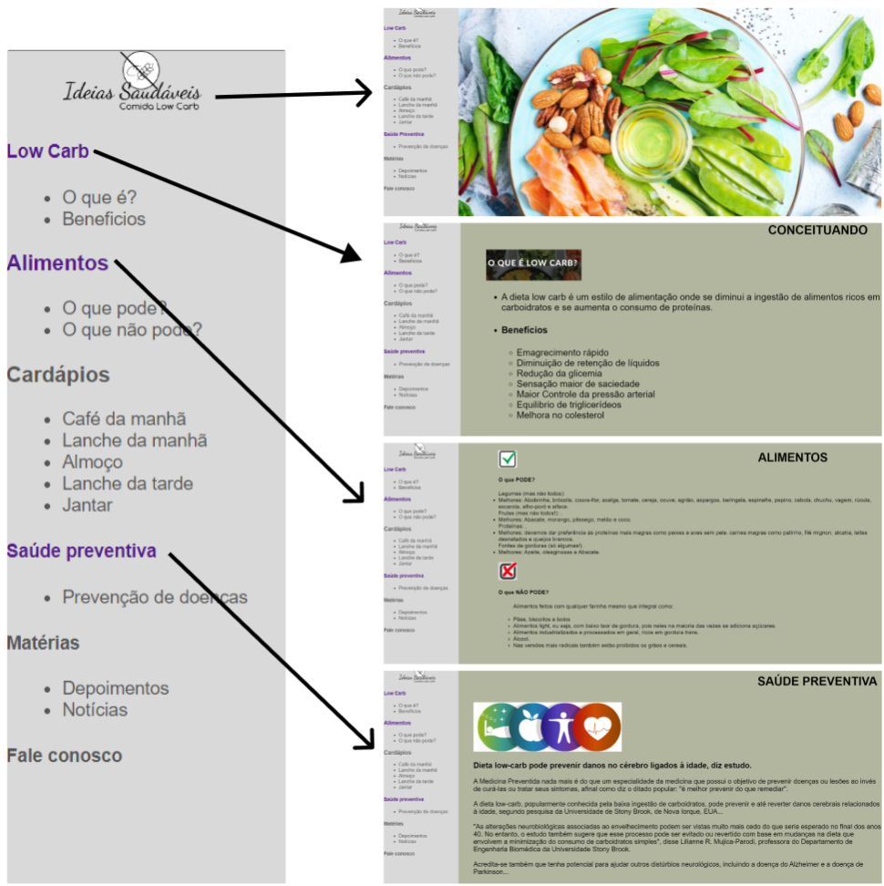

# Plano de Testes de Software

Segue para apreciação, o fluxo de funcionalidades baseadas nas telas produzidas e com os testes devidamente aplicados:   

Podemos visualizar abaixo os cenários de testes que demonstrem os requisitos sendo satisfeitos.

 

<strong> Cenários: </strong>

1. <mark> Tela Home: </mark> Tela principal de acesso a todas as telas/funcionalidades do portal. Ao clicar no link, o usuário é direcionado a ambientes específicos focados em determinado assunto. 

2. <mark> Tela Low Carb:</mark> Ao clicar em Low Carb na tela home, o usuário é direcionado a tela especifica com os conceitos de Comida Low Carb e os benefícios à saúde na ingestão desses alimentos. Nesta tela o usuário tem a opção de migrar para outras telas do portal (Alimentos e Saúde Preventiva) ou retornar para a home, clicando no logomarca disposta no cabeçalho da página. 

3. <mark> Tela Alimentos: </mark> Ao clicar em Alimentos na tela home, o usuário é direcionado a uma tela exemplificativa contendo os principais alimentos que podem e não podem fazer parte de uma dieta Low Carb. Nesta tela o usuário tem a opção de migrar para outras telas do portal (Low Carb e Saúde Preventiva) ou retornar para a Home, clicando no logomarca disposta no cabeçalho da página. 

4. <mark>Tela Saúde Preventiva:</mark> Ao clicar em Saúde Preventiva na tela home, o usuário é direcionado a uma tela descritiva contendo informações sobre os benefícios à saúde e como a ingestão desses alimentos ajudam na prevenção de inúmeras doenças. Nesta tela o usuário tem a opção de migrar para outras telas do portal (Low Carb e Alimentos) ou retornar para a Home, clicando no logomarca disposta no cabeçalho da página. 

## Ferramentas de Testes (Opcional)

Comente sobre as ferramentas de testes utilizadas.
 

